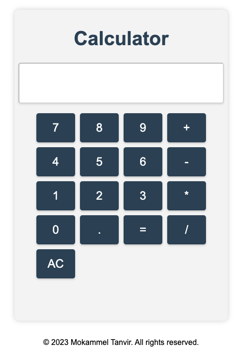

# Calculator Vue App

A simple calculator web application built with Vue.js.

## Demo

You can see a live demo of the calculator app [here](https://calculator-vue-mt.vercel.app/).

## Features

- Responsive and user-friendly UI.
- Performs basic arithmetic calculations.
- Includes AC (All Clear) button to clear the input.
- Displays the calculated result in real-time.

## Screenshots



## Getting Started

### Prerequisites

- Node.js (v14 or above)
- npm (v6 or above)

### Installation

1. Clone the repository:

   ```sh
   git clone https://github.com/mokammeltanvir/Calculator-Vue.git
   ```

2. Navigate to the project directory:

   ```sh
   cd Calculator-Vue
   ```

3. Install the dependencies:

   ```sh
   npm install
   ```

4. Run the app:

   ```sh
    npm run dev
   ```

5. Open the app in your browser:

   ```sh
   http://localhost:5173/
   ```
